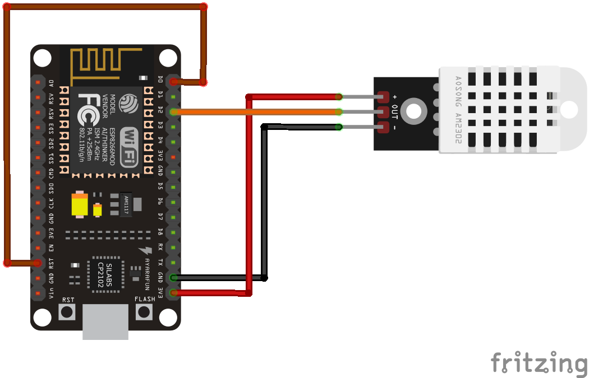

# termocloud
Almacenamiento en la nube (Azure Functions) de la temperatura y la humedad

## ESP8266

El pin de alimentación (+) del sensor lo conectamos a uno de salida de 3,3V del NodeMCU, el de GND (-) a uno de GND, y por último, el pin central de datos lo conectamos a un pin GPIO de la placa (pin `D2`).

Para activar la función de *Deep Sleep* se conecta el pin `D0` al pin `RST`.

## Azure Functions
He creado una **Azure Function** llamada *estacion-jrpm*.

Dentro de ella está la función llamada *escribe_lecturas* con el código almacenado en `function_app.py`.

Es necesario que exista una base de datos de MongoDB para almacenar las lecturas.
